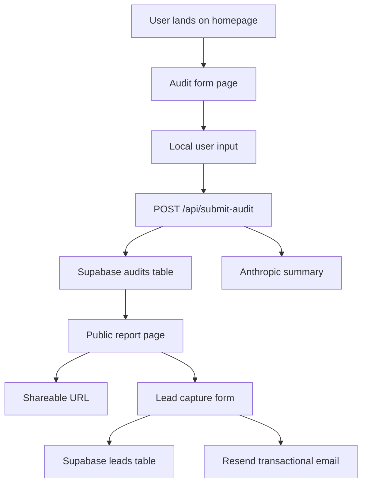

# Architecture

## System overview

Credex Audit is a lightweight Next.js App Router application with a server-backed audit engine and shareable reporting.

- `app/`: page routes, metadata, and SEO
- `components/`: reusable UI and feature sections
- `lib/`: business logic, validation, Supabase, and Anthropic integration
- `data/`: supported AI tool catalog and pricing structure
- `tests/`: engine-level unit tests

## Data flow

## Scalability

The application is designed to support up to 10k audits per day with a straightforward serverless architecture:

- Supabase handles storage and indexing of reports
- Next.js App Router scales horizontally on Vercel
- The audit engine is stateless and deterministic
- AI summary generation is isolated behind a dedicated external API call

## Stack decisions

- **Next.js App Router**: modern routing, SEO metadata, and server components
- **TypeScript**: strong typing for audit payloads and report data
- **Tailwind CSS**: polished startup aesthetic without a heavyweight UI library
- **Supabase**: persistent backend for reports and leads with minimal overhead
- **Anthropic**: premium summary generation while core logic stays deterministic
- **Resend**: transactional email delivery with simple serverless integration

## 10k audits/day discussion

To support this load, the system relies on:

- serverless Supabase inserts for audit records
- a stateless front end with no session storage
- batched analytics and minimal edge functions
- fallback summaries when AI rate limits are hit

The audit engine can run in under 20ms per request, making it suitable for a high-volume launch.
